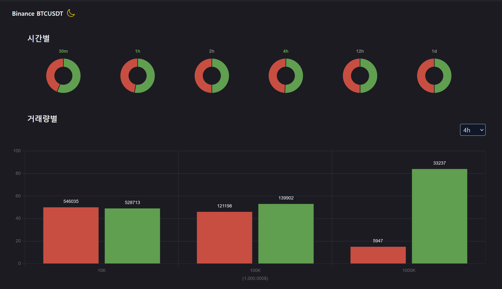
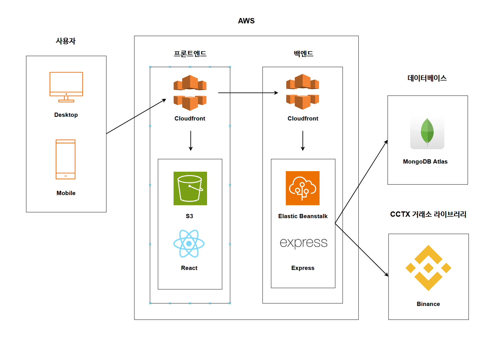

# [Binance-BTCUSDT](https://uttamabitcoin.com/)
바이낸스 비트코인-테더 무기한 선물 거래량 모니터링  
 

 

## 기능
시간별, 규모별 거래량을 알 수 있다. 전체 거래량만을 보여주는 기존 사이트들과 달리 시장 참여자의 거래 규모별로 세분화하였다. 추세의 강도나 전환을 파악하는 거래량 보조지표로 활용할 수 있다. 예를 들어 롱과 숏의 거래량 비율이 일정하다면 횡보가 지속될 가능성이 높다. 반대로 한 쪽에 큰 규모의 거래량이 나타난다면 추세 전환을 의심해 볼 수 있다.  

 

## 구성도

